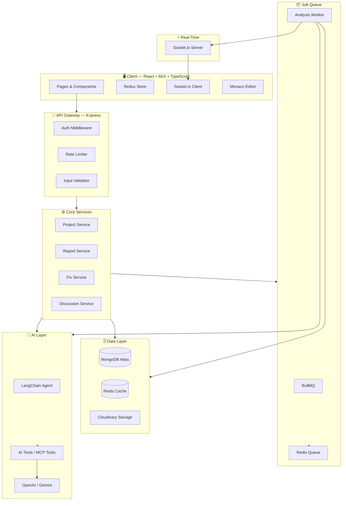
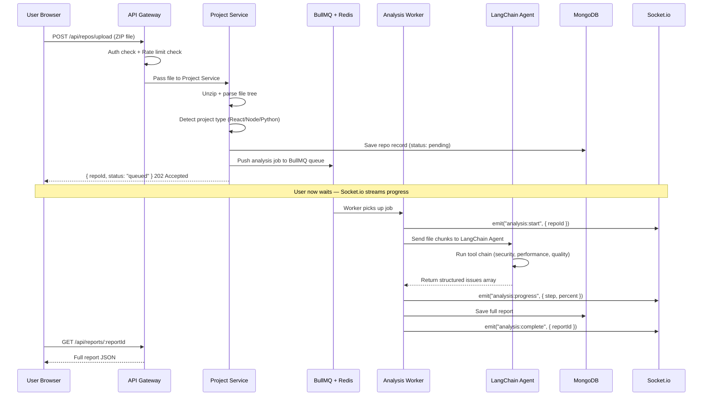
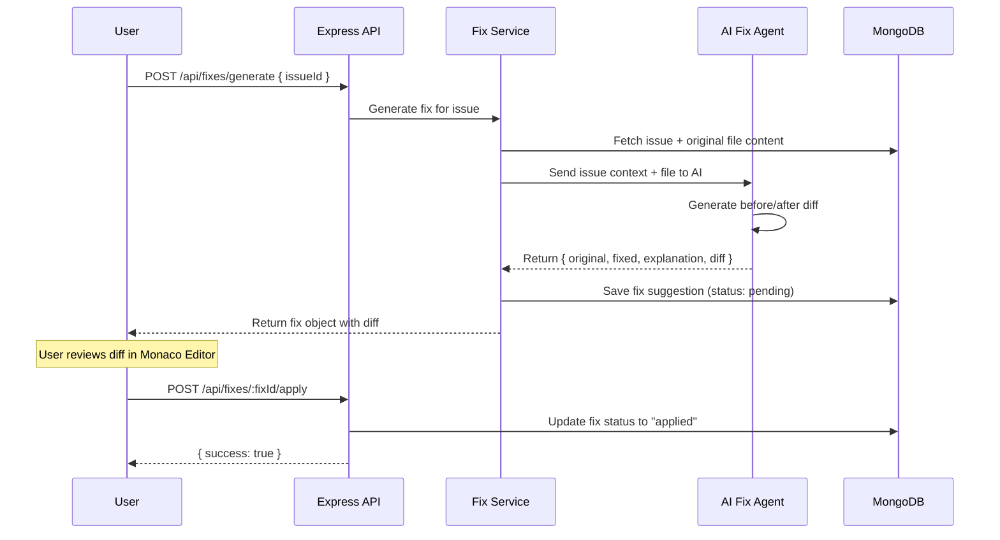
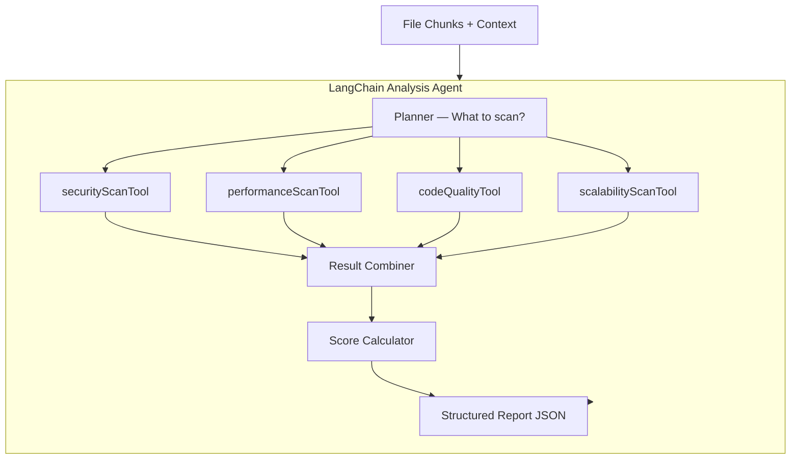
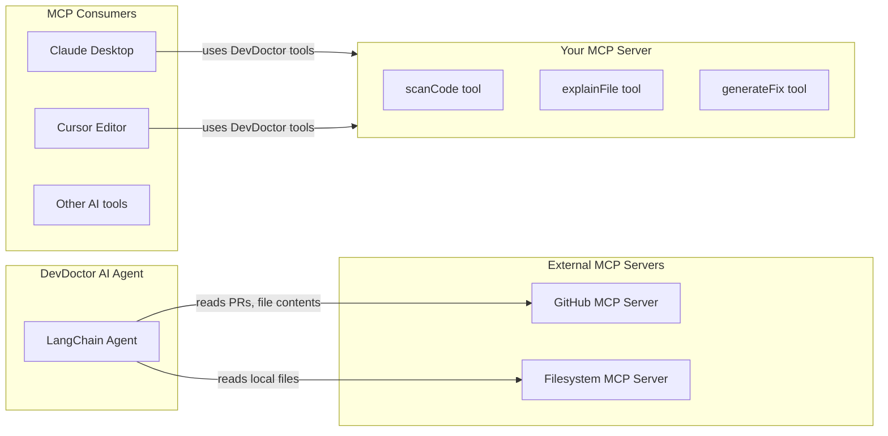
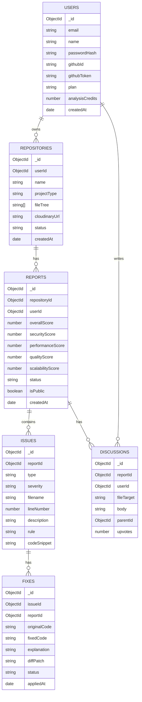
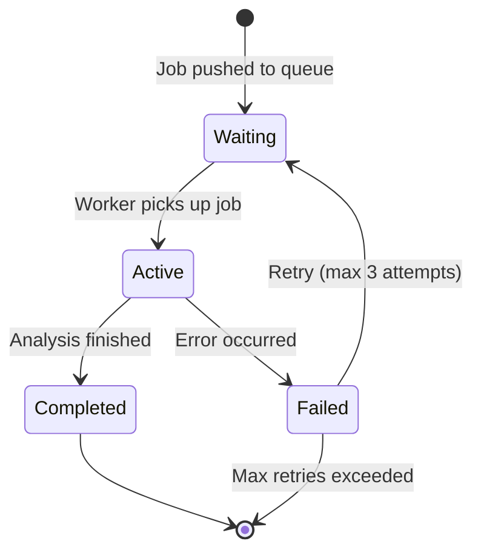
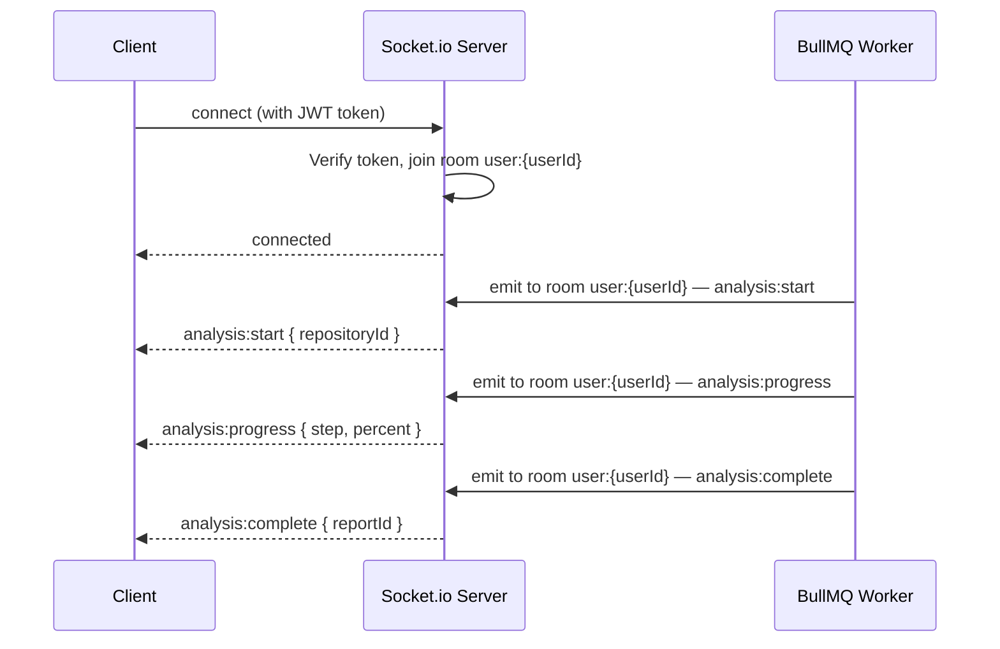
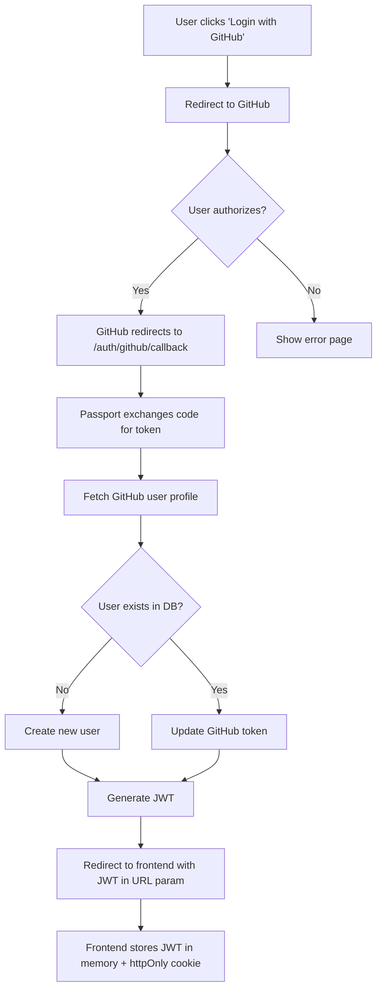
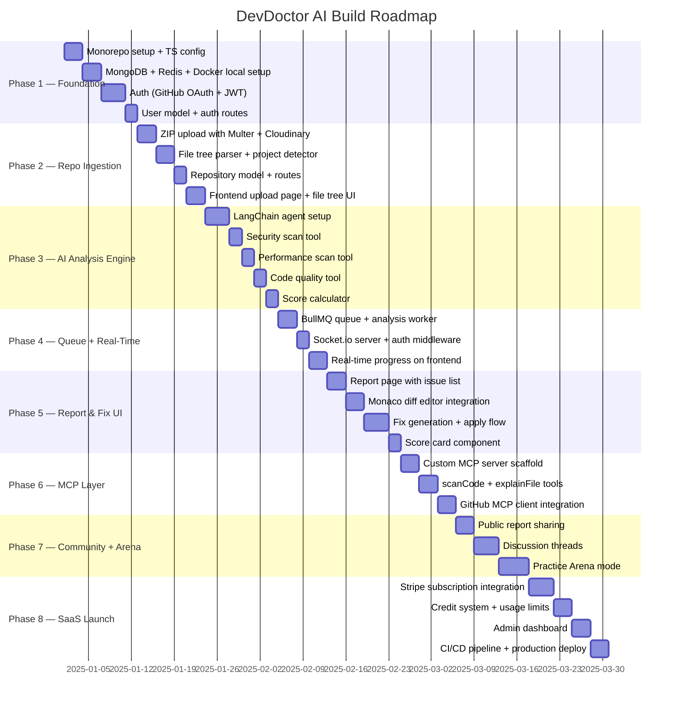

# 🩺 DevDoctor AI — Complete SaaS Product Blueprint

> **The Industry-Grade Playbook** — From zero to a production-ready, AI-powered, agentic code review SaaS platform using MERN + TypeScript + MCP + LangChain

---

## 📌 Table of Contents

1. [Product Vision &amp; Problem Statement](#1-product-vision--problem-statement)
2. [High-Level Architecture Overview](#2-high-level-architecture-overview)
3. [System Design — Request Flow](#3-system-design--request-flow)
4. [Complete Tech Stack Decisions (with Rationale)](#4-complete-tech-stack-decisions-with-rationale)
5. [Monorepo Folder Structure — Every File Explained](#5-monorepo-folder-structure--every-file-explained)
6. [Backend — Detailed Setup &amp; Files](#6-backend--detailed-setup--files)
7. [Frontend — Detailed Setup &amp; Files](#7-frontend--detailed-setup--files)
8. [AI Layer — LangChain + Agentic Architecture](#8-ai-layer--langchain--agentic-architecture)
9. [MCP Integration (Model Context Protocol)](#9-mcp-integration-model-context-protocol)
10. [Database Design — MongoDB Schemas](#10-database-design--mongodb-schemas)
11. [Queue System — Redis + BullMQ](#11-queue-system--redis--bullmq)
12. [Real-Time Layer — Socket.io](#12-real-time-layer--socketio)
13. [Authentication System — GitHub OAuth + JWT](#13-authentication-system--github-oauth--jwt)
14. [Phase-by-Phase Build Plan](#14-phase-by-phase-build-plan)
15. [API Contracts — Every Endpoint](#15-api-contracts--every-endpoint)
16. [DevOps — Docker, CI/CD, Deployment](#16-devops--docker-cicd-deployment)
17. [Resume &amp; Product Launch Strategy](#17-resume--product-launch-strategy)

---

## 1. Product Vision & Problem Statement

### What You're Building

DevDoctor AI is not just a code linter. It is a **senior engineer on demand** — an AI agent that understands your entire codebase, reasons about architectural issues, flags security vulnerabilities, generates diff-ready fixes, and teaches you why the code is broken.

This is a **SaaS product** with a freemium model. You publish it, users sign up, pay monthly for premium analysis credits, and you grow.

### Who It's For

| User Type               | Pain                      | How DevDoctor Solves It                      |
| ----------------------- | ------------------------- | -------------------------------------------- |
| Junior developers       | No code review, no mentor | AI explains every issue like a senior dev    |
| Solo founders           | Ship fast, break things   | One-click security & performance scan        |
| Open source maintainers | PRs with no review        | Public repo scanning with community comments |
| Engineering teams       | No automated review gate  | CI/CD integration for every PR               |

---

## 2. High-Level Architecture Overview



---

## 3. System Design — Request Flow

### Flow 1 — User Uploads a Repository



### Flow 2 — User Requests a Fix



---

## 4. Complete Tech Stack Decisions (with Rationale)

### Frontend

| Tool                   | Version  | Why                                                        |
| ---------------------- | -------- | ---------------------------------------------------------- |
| React                  | 18.x     | Industry standard, best ecosystem                          |
| TypeScript             | 5.x      | Type safety, better IDE support, fewer runtime bugs        |
| Material UI (MUI)      | v6       | Comprehensive design system, production-ready components   |
| Vite                   | 5.x      | Fastest dev server, native ESM, better DX than CRA         |
| Redux Toolkit          | 2.x      | Predictable global state, DevTools, RTK Query built in     |
| RTK Query              | (in RTK) | Auto-caching API layer, removes Axios boilerplate          |
| Socket.io Client       | 4.x      | Real-time progress streaming                               |
| Monaco Editor          | latest   | VS Code in browser — essential for diff viewing           |
| React Router v6        | 6.x      | File-based routing, loaders, actions                       |
| React Hook Form        | 7.x      | Performant forms with minimal re-renders                   |
| Zod                    | 3.x      | Runtime schema validation (shared with backend)            |
| Framer Motion          | 11.x     | Smooth UI transitions                                      |
| React Query (TanStack) | v5       | Server state management (complement to Redux for API data) |

### Backend

| Tool               | Version | Why                                         |
| ------------------ | ------- | ------------------------------------------- |
| Node.js            | 20 LTS  | Latest stable, best performance             |
| Express            | 5.x     | Minimal, flexible, industry standard        |
| TypeScript         | 5.x     | End-to-end type safety                      |
| Mongoose           | 8.x     | MongoDB ODM, schema enforcement             |
| BullMQ             | 5.x     | Redis-backed job queue, retries, priorities |
| Socket.io          | 4.x     | Real-time bidirectional events              |
| Multer             | 2.x     | File upload handling                        |
| Passport.js        | 0.7.x   | GitHub OAuth strategy                       |
| jsonwebtoken       | 9.x     | JWT creation and verification               |
| bcrypt             | 5.x     | Password hashing                            |
| express-rate-limit | 7.x     | API rate limiting                           |
| Helmet             | 8.x     | Security HTTP headers                       |
| Morgan             | 1.x     | HTTP request logging                        |
| Winston            | 3.x     | Structured application logging              |
| Zod                | 3.x     | Schema validation (shared with frontend)    |
| cors               | 2.x     | Cross-origin request handling               |
| dotenv             | 16.x    | Environment variable management             |

### AI Layer

| Tool                | Why                                              |
| ------------------- | ------------------------------------------------ |
| LangChain.js        | Agentic orchestration, tool use, prompt chaining |
| OpenAI API (GPT-4o) | Primary LLM — best code reasoning               |
| Google Gemini API   | Fallback LLM — cost optimization                |
| tiktoken            | Token counting before sending large files        |
| LangChain Tools     | Custom tools for security scan, perf scan, etc.  |
| LangGraph (JS)      | State machine for multi-step agentic workflows   |

### MCP (Model Context Protocol)

| What                  | Why                                             |
| --------------------- | ----------------------------------------------- |
| @anthropic-ai/sdk MCP | Connect your AI agent to external tools via MCP |
| GitHub MCP Server     | Read PR context, push fix suggestions           |
| Custom MCP Server     | Your own DevDoctor tools as MCP tools           |

### Database & Infrastructure

| Tool            | Why                                        |
| --------------- | ------------------------------------------ |
| MongoDB Atlas   | Managed cloud MongoDB — free tier to paid |
| Redis (Upstash) | Managed Redis for queue + cache + sessions |
| Cloudinary      | File and ZIP storage                       |
| Docker          | Containerize everything                    |
| GitHub Actions  | CI/CD pipeline                             |
| Vercel          | Frontend deployment (instant)              |
| Render          | Backend + worker deployment                |

---

## 5. Monorepo Folder Structure — Every File Explained

```
devdoctor-ai/
│
├── 📁 client/                          # React + TypeScript Frontend
│   ├── public/
│   │   └── favicon.ico
│   ├── src/
│   │   ├── 📁 assets/                  # Images, icons, fonts
│   │   │
│   │   ├── 📁 components/              # Reusable UI components
│   │   │   ├── 📁 common/              # Generic: Button, Modal, Badge
│   │   │   │   ├── AppButton.tsx
│   │   │   │   ├── AppModal.tsx
│   │   │   │   ├── AppBadge.tsx
│   │   │   │   ├── LoadingSpinner.tsx
│   │   │   │   └── ErrorBoundary.tsx
│   │   │   ├── 📁 layout/              # Navbar, Sidebar, Footer
│   │   │   │   ├── Navbar.tsx
│   │   │   │   ├── Sidebar.tsx
│   │   │   │   ├── AppLayout.tsx
│   │   │   │   └── Footer.tsx
│   │   │   ├── 📁 repo/                # Repository-specific components
│   │   │   │   ├── RepoUploader.tsx    # ZIP upload drag-and-drop
│   │   │   │   ├── FileTreeView.tsx    # Visual project map
│   │   │   │   └── RepoCard.tsx
│   │   │   ├── 📁 report/             # Report & issue display
│   │   │   │   ├── IssueCard.tsx       # Single issue with fix button
│   │   │   │   ├── ScoreCard.tsx       # Architecture score widget
│   │   │   │   ├── IssueList.tsx
│   │   │   │   └── ProgressStream.tsx  # Real-time Socket.io progress
│   │   │   ├── 📁 editor/             # Monaco editor wrappers
│   │   │   │   ├── DiffViewer.tsx      # Before/After diff display
│   │   │   │   └── CodeExplainer.tsx   # AI explanation panel
│   │   │   └── 📁 dashboard/
│   │   │       ├── StatsWidget.tsx
│   │   │       └── RecentRepos.tsx
│   │   │
│   │   ├── 📁 pages/                   # Route-level page components
│   │   │   ├── LandingPage.tsx         # Marketing homepage
│   │   │   ├── LoginPage.tsx
│   │   │   ├── RegisterPage.tsx
│   │   │   ├── DashboardPage.tsx       # User dashboard
│   │   │   ├── UploadPage.tsx          # Upload new repo
│   │   │   ├── ReportPage.tsx          # Full analysis report
│   │   │   ├── FixReviewPage.tsx       # Review + apply fix
│   │   │   ├── ExplainerPage.tsx       # File explanation
│   │   │   ├── DiscussionPage.tsx      # Community comments
│   │   │   ├── PracticeArenaPage.tsx   # Code challenge mode
│   │   │   ├── SettingsPage.tsx
│   │   │   └── NotFoundPage.tsx
│   │   │
│   │   ├── 📁 store/                   # Redux Toolkit state
│   │   │   ├── index.ts                # Store configuration
│   │   │   ├── 📁 slices/
│   │   │   │   ├── authSlice.ts        # User auth state
│   │   │   │   ├── repoSlice.ts        # Repository state
│   │   │   │   ├── reportSlice.ts      # Report state
│   │   │   │   └── fixSlice.ts         # Fix history state
│   │   │   └── 📁 api/                 # RTK Query API definitions
│   │   │       ├── baseApi.ts
│   │   │       ├── authApi.ts
│   │   │       ├── repoApi.ts
│   │   │       ├── reportApi.ts
│   │   │       └── fixApi.ts
│   │   │
│   │   ├── 📁 hooks/                   # Custom React hooks
│   │   │   ├── useSocket.ts            # Socket.io connection hook
│   │   │   ├── useAnalysisProgress.ts  # Real-time progress hook
│   │   │   └── useAuth.ts
│   │   │
│   │   ├── 📁 theme/                   # MUI theme customization
│   │   │   ├── index.ts                # Theme export
│   │   │   ├── palette.ts              # Colors
│   │   │   ├── typography.ts           # Font settings
│   │   │   └── components.ts           # Override MUI components
│   │   │
│   │   ├── 📁 types/                   # TypeScript type definitions
│   │   │   ├── repo.types.ts
│   │   │   ├── report.types.ts
│   │   │   ├── fix.types.ts
│   │   │   └── user.types.ts
│   │   │
│   │   ├── 📁 utils/                   # Helper functions
│   │   │   ├── formatDate.ts
│   │   │   ├── getSeverityColor.ts
│   │   │   └── tokenStorage.ts         # JWT token helpers
│   │   │
│   │   ├── App.tsx                     # Root component + Router
│   │   ├── main.tsx                    # ReactDOM render entry
│   │   └── vite-env.d.ts
│   │
│   ├── .env.example
│   ├── index.html
│   ├── tsconfig.json
│   ├── vite.config.ts
│   └── package.json
│
├── 📁 server/                          # Node.js + TypeScript Backend
│   ├── src/
│   │   ├── 📁 config/                  # All configuration files
│   │   │   ├── database.ts             # MongoDB connection
│   │   │   ├── redis.ts                # Redis connection
│   │   │   ├── cloudinary.ts           # Cloudinary setup
│   │   │   ├── passport.ts             # GitHub OAuth strategy
│   │   │   ├── socket.ts               # Socket.io setup
│   │   │   └── env.ts                  # Validated env with Zod
│   │   │
│   │   ├── 📁 routes/                  # Express route definitions
│   │   │   ├── index.ts                # Mount all routers here
│   │   │   ├── auth.routes.ts
│   │   │   ├── repo.routes.ts
│   │   │   ├── report.routes.ts
│   │   │   ├── fix.routes.ts
│   │   │   ├── discussion.routes.ts
│   │   │   └── user.routes.ts
│   │   │
│   │   ├── 📁 controllers/             # Request handlers (thin layer)
│   │   │   ├── auth.controller.ts
│   │   │   ├── repo.controller.ts
│   │   │   ├── report.controller.ts
│   │   │   ├── fix.controller.ts
│   │   │   ├── discussion.controller.ts
│   │   │   └── user.controller.ts
│   │   │
│   │   ├── 📁 services/                # All business logic lives here
│   │   │   ├── auth.service.ts         # Login, register, token
│   │   │   ├── repo.service.ts         # Parse, map, store repos
│   │   │   ├── report.service.ts       # Fetch/manage reports
│   │   │   ├── fix.service.ts          # Generate + apply fixes
│   │   │   ├── analysis.service.ts     # Orchestrate AI analysis
│   │   │   ├── ai.service.ts           # LangChain agent calls
│   │   │   ├── queue.service.ts        # BullMQ job management
│   │   │   └── discussion.service.ts
│   │   │
│   │   ├── 📁 workers/                 # BullMQ background workers
│   │   │   ├── analysis.worker.ts      # Picks jobs, calls AI service
│   │   │   └── cleanup.worker.ts       # Remove expired reports
│   │   │
│   │   ├── 📁 models/                  # Mongoose schemas
│   │   │   ├── User.model.ts
│   │   │   ├── Repository.model.ts
│   │   │   ├── Report.model.ts
│   │   │   ├── Issue.model.ts
│   │   │   ├── Fix.model.ts
│   │   │   ├── Discussion.model.ts
│   │   │   └── Job.model.ts
│   │   │
│   │   ├── 📁 middleware/              # Express middleware
│   │   │   ├── auth.middleware.ts      # JWT verification
│   │   │   ├── validate.middleware.ts  # Zod schema validation
│   │   │   ├── upload.middleware.ts    # Multer file upload
│   │   │   ├── rateLimiter.middleware.ts
│   │   │   └── errorHandler.middleware.ts
│   │   │
│   │   ├── 📁 ai/                      # AI subsystem
│   │   │   ├── 📁 agents/
│   │   │   │   ├── analysisAgent.ts    # Main LangChain analysis agent
│   │   │   │   └── fixAgent.ts         # Fix generation agent
│   │   │   ├── 📁 tools/               # LangChain tools
│   │   │   │   ├── securityScanTool.ts
│   │   │   │   ├── performanceScanTool.ts
│   │   │   │   ├── codeQualityTool.ts
│   │   │   │   └── fileExplainerTool.ts
│   │   │   ├── 📁 prompts/             # Prompt templates
│   │   │   │   ├── analysis.prompt.ts
│   │   │   │   ├── fix.prompt.ts
│   │   │   │   └── explainer.prompt.ts
│   │   │   └── 📁 mcp/                 # MCP client setup
│   │   │       ├── mcpClient.ts        # Connect to MCP servers
│   │   │       └── githubMcpTools.ts   # GitHub MCP integration
│   │   │
│   │   ├── 📁 types/                   # TypeScript types
│   │   │   ├── express.d.ts            # Extend Express Request type
│   │   │   ├── repo.types.ts
│   │   │   ├── report.types.ts
│   │   │   └── ai.types.ts
│   │   │
│   │   ├── 📁 utils/                   # Server utilities
│   │   │   ├── logger.ts               # Winston logger
│   │   │   ├── tokenCounter.ts         # tiktoken file chunker
│   │   │   ├── fileParser.ts           # ZIP unzip + tree builder
│   │   │   ├── projectDetector.ts      # Detect React/Node/Python
│   │   │   └── apiError.ts             # Custom error class
│   │   │
│   │   └── app.ts                      # Express app entry point
│   │
│   ├── .env.example
│   ├── tsconfig.json
│   ├── nodemon.json
│   └── package.json
│
├── 📁 shared/                          # Shared between client and server
│   ├── 📁 schemas/                     # Zod schemas
│   │   ├── auth.schema.ts
│   │   ├── repo.schema.ts
│   │   └── report.schema.ts
│   └── 📁 types/                       # Shared TypeScript types
│       ├── api.types.ts
│       └── socket.types.ts
│
├── 📁 mcp-server/                      # Your Custom MCP Server
│   ├── src/
│   │   ├── index.ts                    # MCP server entry point
│   │   └── 📁 tools/                   # Your DevDoctor MCP tools
│   │       ├── scanCode.tool.ts
│   │       └── explainFile.tool.ts
│   └── package.json
│
├── 📁 docker/                          # Docker config
│   ├── Dockerfile.client
│   ├── Dockerfile.server
│   └── Dockerfile.worker
│
├── 📁 .github/
│   └── 📁 workflows/
│       ├── ci.yml                      # Run tests on PR
│       └── deploy.yml                  # Deploy on merge to main
│
├── docker-compose.yml                  # Full local stack
├── docker-compose.prod.yml             # Production overrides
├── .gitignore
├── README.md
└── package.json                        # Root workspace scripts
```

---

## 6. Backend — Detailed Setup & Files

### Step 6.1 — Initialize the Backend

```bash
		mkdir server && cd server
npm init -y
npm install express mongoose bullmq socket.io multer cloudinary passport passport-github2 jsonwebtoken bcrypt express-rate-limit helmet morgan winston express-validator zod cors dotenv langchain @langchain/openai @langchain/community openai tiktoken ioredis @anthropic-ai/sdk
npm install -D typescript ts-node nodemon @types/node @types/express @types/mongoose @types/passport @types/passport-github2 @types/jsonwebtoken @types/bcrypt @types/multer @types/cors @types/morgan
npx tsc --init
```

### Step 6.2 — `tsconfig.json` (Strict Mode)

```json
{
  "compilerOptions": {
    "target": "ES2022",
    "module": "commonjs",
    "lib": ["ES2022"],
    "outDir": "./dist",
    "rootDir": "./src",
    "strict": true,
    "esModuleInterop": true,
    "skipLibCheck": true,
    "forceConsistentCasingInFileNames": true,
    "resolveJsonModule": true,
    "declaration": true,
    "declarationMap": true,
    "sourceMap": true,
    "baseUrl": ".",
    "paths": {
      "@/*": ["src/*"],
      "@shared/*": ["../shared/*"]
    }
  },
  "include": ["src/**/*"],
  "exclude": ["node_modules", "dist"]
}
```

### Step 6.3 — `src/config/env.ts` — Validated Environment Variables

```typescript
import { z } from 'zod';
import dotenv from 'dotenv';
dotenv.config();

const envSchema = z.object({
  NODE_ENV: z.enum(['development', 'production', 'test']).default('development'),
  PORT: z.string().default('5000'),
  MONGODB_URI: z.string().min(1, 'MongoDB URI required'),
  REDIS_URL: z.string().min(1, 'Redis URL required'),
  JWT_SECRET: z.string().min(32, 'JWT secret must be at least 32 chars'),
  JWT_EXPIRES_IN: z.string().default('7d'),
  GITHUB_CLIENT_ID: z.string().min(1),
  GITHUB_CLIENT_SECRET: z.string().min(1),
  GITHUB_CALLBACK_URL: z.string().url(),
  OPENAI_API_KEY: z.string().min(1),
  GEMINI_API_KEY: z.string().optional(),
  CLOUDINARY_CLOUD_NAME: z.string().min(1),
  CLOUDINARY_API_KEY: z.string().min(1),
  CLOUDINARY_API_SECRET: z.string().min(1),
  CLIENT_URL: z.string().url().default('http://localhost:3000'),
});

const parsed = envSchema.safeParse(process.env);

if (!parsed.success) {
  console.error('❌ Invalid environment variables:', parsed.error.format());
  process.exit(1);
}

export const env = parsed.data;
```

### Step 6.4 — `src/app.ts` — Express App Setup

```typescript
import express from 'express';
import cors from 'cors';
import helmet from 'helmet';
import morgan from 'morgan';
import { createServer } from 'http';
import { initSocket } from './config/socket';
import { connectDB } from './config/database';
import { connectRedis } from './config/redis';
import { errorHandler } from './middleware/errorHandler.middleware';
import routes from './routes/index';
import { env } from './config/env';

const app = express();
const httpServer = createServer(app);

// Initialize Socket.io
initSocket(httpServer);

// Middleware
app.use(helmet());
app.use(cors({ origin: env.CLIENT_URL, credentials: true }));
app.use(morgan('combined'));
app.use(express.json({ limit: '10mb' }));
app.use(express.urlencoded({ extended: true }));

// Routes
app.use('/api', routes);

// Health check
app.get('/health', (_, res) => res.json({ status: 'ok', timestamp: new Date().toISOString() }));

// Error handler — must be last
app.use(errorHandler);

const PORT = parseInt(env.PORT, 10);

const start = async () => {
  await connectDB();
  await connectRedis();
  httpServer.listen(PORT, () => {
    console.log(`🚀 Server running on port ${PORT}`);
  });
};

start();

export { app, httpServer };
```

### Step 6.5 — `src/middleware/errorHandler.middleware.ts`

```typescript
import { Request, Response, NextFunction } from 'express';
import { ApiError } from '../utils/apiError';
import { logger } from '../utils/logger';

export const errorHandler = (
  err: Error,
  req: Request,
  res: Response,
  _next: NextFunction
) => {
  logger.error(`${err.name}: ${err.message}`, { stack: err.stack, path: req.path });

  if (err instanceof ApiError) {
    return res.status(err.statusCode).json({
      success: false,
      message: err.message,
      errors: err.errors ?? [],
    });
  }

  return res.status(500).json({
    success: false,
    message: 'Internal Server Error',
  });
};
```

### Step 6.6 — `src/utils/apiError.ts`

```typescript
export class ApiError extends Error {
  constructor(
    public statusCode: number,
    public message: string,
    public errors?: string[]
  ) {
    super(message);
    this.name = 'ApiError';
    Error.captureStackTrace(this, this.constructor);
  }

  static badRequest(msg: string, errors?: string[]) {
    return new ApiError(400, msg, errors);
  }
  static unauthorized(msg = 'Unauthorized') {
    return new ApiError(401, msg);
  }
  static forbidden(msg = 'Forbidden') {
    return new ApiError(403, msg);
  }
  static notFound(msg = 'Not Found') {
    return new ApiError(404, msg);
  }
  static internal(msg = 'Internal Server Error') {
    return new ApiError(500, msg);
  }
}
```

---

## 7. Frontend — Detailed Setup & Files

### Step 7.1 — Initialize Frontend

```bash
npm create vite@latest client -- --template react-ts
cd client
npm install @mui/material @emotion/react @emotion/styled @mui/icons-material
npm install @reduxjs/toolkit react-redux
npm install react-router-dom socket.io-client
npm install @monaco-editor/react
npm install react-hook-form zod @hookform/resolvers
npm install framer-motion
npm install axios
```

### Step 7.2 — MUI Theme Setup (`src/theme/index.ts`)

```typescript
import { createTheme } from '@mui/material/styles';

export const theme = createTheme({
  palette: {
    mode: 'dark',
    primary: {
      main: '#00C896',         // DevDoctor green — health/medical brand
      light: '#33D4AB',
      dark: '#00956E',
    },
    secondary: {
      main: '#7C3AED',         // Purple accent for AI elements
    },
    error: {
      main: '#EF4444',         // Security issues — red
    },
    warning: {
      main: '#F59E0B',         // Performance issues — amber
    },
    info: {
      main: '#3B82F6',         // Info and scalability — blue
    },
    background: {
      default: '#0A0A0F',      // Near-black background
      paper: '#111118',        // Slightly lighter card bg
    },
  },
  typography: {
    fontFamily: '"Inter", "Roboto", "Helvetica", "Arial", sans-serif',
    h1: { fontWeight: 700, letterSpacing: '-0.02em' },
    h2: { fontWeight: 700 },
    h3: { fontWeight: 600 },
    code: {
      fontFamily: '"JetBrains Mono", "Fira Code", monospace',
    },
  },
  shape: {
    borderRadius: 12,
  },
  components: {
    MuiButton: {
      styleOverrides: {
        root: {
          textTransform: 'none',
          fontWeight: 600,
          borderRadius: 8,
        },
      },
    },
    MuiCard: {
      styleOverrides: {
        root: {
          border: '1px solid rgba(255,255,255,0.06)',
          backgroundImage: 'none',
        },
      },
    },
  },
});
```

### Step 7.3 — `src/App.tsx` — Router Setup

```typescript
import { BrowserRouter, Routes, Route, Navigate } from 'react-router-dom';
import { ThemeProvider } from '@mui/material/styles';
import { CssBaseline } from '@mui/material';
import { Provider } from 'react-redux';
import { store } from './store';
import { theme } from './theme';
import AppLayout from './components/layout/AppLayout';
import LandingPage from './pages/LandingPage';
import DashboardPage from './pages/DashboardPage';
import UploadPage from './pages/UploadPage';
import ReportPage from './pages/ReportPage';
import FixReviewPage from './pages/FixReviewPage';
import LoginPage from './pages/LoginPage';
import ProtectedRoute from './components/common/ProtectedRoute';

export default function App() {
  return (
    <Provider store={store}>
      <ThemeProvider theme={theme}>
        <CssBaseline />
        <BrowserRouter>
          <Routes>
            <Route path="/" element={<LandingPage />} />
            <Route path="/login" element={<LoginPage />} />
            <Route element={<ProtectedRoute />}>
              <Route element={<AppLayout />}>
                <Route path="/dashboard" element={<DashboardPage />} />
                <Route path="/upload" element={<UploadPage />} />
                <Route path="/reports/:reportId" element={<ReportPage />} />
                <Route path="/fixes/:fixId" element={<FixReviewPage />} />
              </Route>
            </Route>
            <Route path="*" element={<Navigate to="/" replace />} />
          </Routes>
        </BrowserRouter>
      </ThemeProvider>
    </Provider>
  );
}
```

### Step 7.4 — `src/hooks/useSocket.ts` — Real-Time Hook

```typescript
import { useEffect, useRef } from 'react';
import { io, Socket } from 'socket.io-client';
import { useSelector } from 'react-redux';
import { RootState } from '../store';

export const useSocket = () => {
  const socketRef = useRef<Socket | null>(null);
  const token = useSelector((state: RootState) => state.auth.token);

  useEffect(() => {
    if (!token) return;

    socketRef.current = io(import.meta.env.VITE_API_URL, {
      auth: { token },
      transports: ['websocket'],
    });

    socketRef.current.on('connect', () => {
      console.log('Socket connected:', socketRef.current?.id);
    });

    return () => {
      socketRef.current?.disconnect();
    };
  }, [token]);

  return socketRef.current;
};
```

---

## 8. AI Layer — LangChain + Agentic Architecture

### Architecture of the AI Agent



### Step 8.1 — `src/ai/agents/analysisAgent.ts`

```typescript
import { ChatOpenAI } from '@langchain/openai';
import { AgentExecutor, createToolCallingAgent } from 'langchain/agents';
import { ChatPromptTemplate, MessagesPlaceholder } from '@langchain/core/prompts';
import { securityScanTool } from '../tools/securityScanTool';
import { performanceScanTool } from '../tools/performanceScanTool';
import { codeQualityTool } from '../tools/codeQualityTool';
import { env } from '../../config/env';

const llm = new ChatOpenAI({
  model: 'gpt-4o',
  temperature: 0,
  apiKey: env.OPENAI_API_KEY,
});

const tools = [securityScanTool, performanceScanTool, codeQualityTool];

const prompt = ChatPromptTemplate.fromMessages([
  ['system', `You are DevDoctor, a senior software engineer and security expert. 
  Analyze the provided code files and detect:
  1. Security vulnerabilities (XSS, SQL injection, hardcoded secrets, weak auth)
  2. Performance issues (N+1 queries, missing indexes, no pagination, memory leaks)
  3. Scalability problems (monolithic controllers, no separation of concerns)
  4. Code quality issues (no error handling, missing validation, console.logs in prod)
  
  Return structured JSON with severity scores and specific line numbers.`],
  ['human', '{input}'],
  new MessagesPlaceholder('agent_scratchpad'),
]);

export async function runAnalysisAgent(fileChunks: string[], projectType: string) {
  const agent = createToolCallingAgent({ llm, tools, prompt });
  const executor = new AgentExecutor({ agent, tools, verbose: true });

  const result = await executor.invoke({
    input: `Analyze this ${projectType} project:\n\n${fileChunks.join('\n\n---\n\n')}`,
  });

  return result.output;
}
```

### Step 8.2 — `src/ai/tools/securityScanTool.ts`

```typescript
import { tool } from '@langchain/core/tools';
import { z } from 'zod';

export const securityScanTool = tool(
  async ({ code, filename }) => {
    // This tool runs targeted security pattern matching
    // The LLM calls this tool with specific file contents
    const issues: SecurityIssue[] = [];

    // Pattern-based pre-checks before LLM reasoning
    if (code.includes('eval(')) {
      issues.push({
        type: 'security',
        severity: 'critical',
        rule: 'NO_EVAL',
        description: 'eval() usage detected — can execute arbitrary code',
        filename,
      });
    }

    if (/password\s*=\s*["'][^"']+["']/i.test(code)) {
      issues.push({
        type: 'security',
        severity: 'critical',
        rule: 'HARDCODED_SECRET',
        description: 'Hardcoded password or secret detected',
        filename,
      });
    }

    return JSON.stringify(issues);
  },
  {
    name: 'securityScanTool',
    description: 'Scans a code file for security vulnerabilities. Returns an array of issues.',
    schema: z.object({
      code: z.string().describe('The source code content to analyze'),
      filename: z.string().describe('The filename for context'),
    }),
  }
);

interface SecurityIssue {
  type: string;
  severity: 'critical' | 'high' | 'medium' | 'low';
  rule: string;
  description: string;
  filename: string;
}
```

---

## 9. MCP Integration (Model Context Protocol)

MCP is the most modern AI integration pattern. You implement it in **two ways**:

1. **As a client** — your AI agent connects to external MCP servers (e.g., GitHub's official MCP server) to read PR files, repository info, etc.
2. **As a server** — you expose your own DevDoctor tools as an MCP server so other AI systems (Claude Desktop, Cursor, etc.) can use DevDoctor's analysis capabilities.

### Flow Diagram



### Step 9.1 — `mcp-server/src/index.ts` — Your MCP Server

```typescript
import { Server } from '@modelcontextprotocol/sdk/server/index.js';
import { StdioServerTransport } from '@modelcontextprotocol/sdk/server/stdio.js';
import {
  CallToolRequestSchema,
  ListToolsRequestSchema,
} from '@modelcontextprotocol/sdk/types.js';

const server = new Server(
  {
    name: 'devdoctor-mcp-server',
    version: '1.0.0',
  },
  {
    capabilities: { tools: {} },
  }
);

server.setRequestHandler(ListToolsRequestSchema, async () => ({
  tools: [
    {
      name: 'scan_code',
      description: 'Analyze a code snippet for security, performance, and quality issues',
      inputSchema: {
        type: 'object',
        properties: {
          code: { type: 'string', description: 'The code to analyze' },
          language: { type: 'string', description: 'Programming language (javascript, python, etc.)' },
        },
        required: ['code'],
      },
    },
    {
      name: 'explain_file',
      description: 'Get a detailed AI explanation of what a code file does',
      inputSchema: {
        type: 'object',
        properties: {
          code: { type: 'string', description: 'The file contents' },
          filename: { type: 'string', description: 'The filename for context' },
        },
        required: ['code'],
      },
    },
  ],
}));

server.setRequestHandler(CallToolRequestSchema, async (request) => {
  switch (request.params.name) {
    case 'scan_code': {
      const { code, language } = request.params.arguments as { code: string; language?: string };
      // Call your DevDoctor analysis API here
      const result = await callDevDoctorAPI('/api/analyze/snippet', { code, language });
      return { content: [{ type: 'text', text: JSON.stringify(result) }] };
    }
    case 'explain_file': {
      const { code, filename } = request.params.arguments as { code: string; filename?: string };
      const result = await callDevDoctorAPI('/api/explain', { code, filename });
      return { content: [{ type: 'text', text: result.explanation }] };
    }
    default:
      throw new Error(`Unknown tool: ${request.params.name}`);
  }
});

async function callDevDoctorAPI(path: string, body: object) {
  const res = await fetch(`${process.env.DEVDOCTOR_API_URL}${path}`, {
    method: 'POST',
    headers: { 'Content-Type': 'application/json', 'x-api-key': process.env.DEVDOCTOR_API_KEY ?? '' },
    body: JSON.stringify(body),
  });
  return res.json();
}

const transport = new StdioServerTransport();
await server.connect(transport);
```

---

## 10. Database Design — MongoDB Schemas

### Entity Relationship Diagram



### Step 10.1 — `src/models/Report.model.ts`

```typescript
import mongoose, { Document, Schema } from 'mongoose';

export interface IReport extends Document {
  repositoryId: mongoose.Types.ObjectId;
  userId: mongoose.Types.ObjectId;
  overallScore: number;
  securityScore: number;
  performanceScore: number;
  qualityScore: number;
  scalabilityScore: number;
  status: 'pending' | 'running' | 'completed' | 'failed';
  isPublic: boolean;
  issueCount: number;
  createdAt: Date;
}

const ReportSchema = new Schema<IReport>(
  {
    repositoryId: { type: Schema.Types.ObjectId, ref: 'Repository', required: true, index: true },
    userId: { type: Schema.Types.ObjectId, ref: 'User', required: true, index: true },
    overallScore: { type: Number, min: 0, max: 100 },
    securityScore: { type: Number, min: 0, max: 100 },
    performanceScore: { type: Number, min: 0, max: 100 },
    qualityScore: { type: Number, min: 0, max: 100 },
    scalabilityScore: { type: Number, min: 0, max: 100 },
    status: { type: String, enum: ['pending', 'running', 'completed', 'failed'], default: 'pending' },
    isPublic: { type: Boolean, default: false },
    issueCount: { type: Number, default: 0 },
  },
  { timestamps: true }
);

export const Report = mongoose.model<IReport>('Report', ReportSchema);
```

---

## 11. Queue System — Redis + BullMQ

### Job Flow Diagram



### Step 11.1 — `src/config/redis.ts`

```typescript
import { Redis } from 'ioredis';
import { env } from './env';

let redisClient: Redis;

export const connectRedis = async (): Promise<Redis> => {
  redisClient = new Redis(env.REDIS_URL, {
    maxRetriesPerRequest: null, // Required for BullMQ
    enableReadyCheck: false,
  });

  redisClient.on('connect', () => console.log('✅ Redis connected'));
  redisClient.on('error', (err) => console.error('Redis error:', err));

  return redisClient;
};

export const getRedis = () => {
  if (!redisClient) throw new Error('Redis not connected. Call connectRedis() first.');
  return redisClient;
};
```

### Step 11.2 — `src/services/queue.service.ts`

```typescript
import { Queue, QueueEvents } from 'bullmq';
import { getRedis } from '../config/redis';

export interface AnalysisJobData {
  repositoryId: string;
  userId: string;
  cloudinaryUrl: string;
  projectType: string;
}

let analysisQueue: Queue<AnalysisJobData>;

export const getAnalysisQueue = () => {
  if (!analysisQueue) {
    analysisQueue = new Queue<AnalysisJobData>('analysis', {
      connection: getRedis(),
      defaultJobOptions: {
        attempts: 3,
        backoff: { type: 'exponential', delay: 5000 },
        removeOnComplete: 100,
        removeOnFail: 50,
      },
    });
  }
  return analysisQueue;
};

export const enqueueAnalysis = async (data: AnalysisJobData) => {
  const queue = getAnalysisQueue();
  const job = await queue.add('analyze-repo', data, {
    priority: 1,
  });
  return job.id;
};
```

### Step 11.3 — `src/workers/analysis.worker.ts`

```typescript
import { Worker, Job } from 'bullmq';
import { getRedis } from '../config/redis';
import { AnalysisJobData } from '../services/queue.service';
import { runAnalysisAgent } from '../ai/agents/analysisAgent';
import { Report } from '../models/Report.model';
import { Issue } from '../models/Issue.model';
import { getSocketServer } from '../config/socket';

const worker = new Worker<AnalysisJobData>(
  'analysis',
  async (job: Job<AnalysisJobData>) => {
    const { repositoryId, userId, cloudinaryUrl, projectType } = job.data;
    const io = getSocketServer();

    // Notify client: starting
    io.to(`user:${userId}`).emit('analysis:start', { repositoryId, jobId: job.id });

    try {
      // Update report status
      await Report.findOneAndUpdate({ repositoryId }, { status: 'running' });

      // Step 1: Download and parse files
      job.updateProgress(10);
      io.to(`user:${userId}`).emit('analysis:progress', { step: 'Downloading repository...', percent: 10 });
      const fileChunks = await downloadAndParseRepo(cloudinaryUrl);

      // Step 2: Run AI analysis
      job.updateProgress(30);
      io.to(`user:${userId}`).emit('analysis:progress', { step: 'Running AI analysis...', percent: 30 });
      const analysisResult = await runAnalysisAgent(fileChunks, projectType);

      // Step 3: Save issues
      job.updateProgress(80);
      io.to(`user:${userId}`).emit('analysis:progress', { step: 'Saving results...', percent: 80 });
      await Issue.insertMany(
        analysisResult.issues.map((issue: any) => ({ ...issue, repositoryId }))
      );

      // Step 4: Update report with scores
      const report = await Report.findOneAndUpdate(
        { repositoryId },
        {
          status: 'completed',
          overallScore: analysisResult.scores.overall,
          securityScore: analysisResult.scores.security,
          performanceScore: analysisResult.scores.performance,
          qualityScore: analysisResult.scores.quality,
          scalabilityScore: analysisResult.scores.scalability,
          issueCount: analysisResult.issues.length,
        },
        { new: true }
      );

      job.updateProgress(100);
      io.to(`user:${userId}`).emit('analysis:complete', { repositoryId, reportId: report?._id });
    } catch (error) {
      await Report.findOneAndUpdate({ repositoryId }, { status: 'failed' });
      io.to(`user:${userId}`).emit('analysis:error', { repositoryId, error: (error as Error).message });
      throw error;
    }
  },
  { connection: getRedis(), concurrency: 5 }
);

worker.on('completed', (job) => console.log(`✅ Job ${job.id} completed`));
worker.on('failed', (job, err) => console.error(`❌ Job ${job?.id} failed:`, err));

async function downloadAndParseRepo(url: string): Promise<string[]> {
  // Download ZIP from Cloudinary, unzip, chunk files
  // Return array of stringified file contents
  return [];
}
```

---

## 12. Real-Time Layer — Socket.io

### Event Map



### Step 12.1 — `src/config/socket.ts`

```typescript
import { Server as SocketServer } from 'socket.io';
import { Server as HttpServer } from 'http';
import jwt from 'jsonwebtoken';
import { env } from './env';

let io: SocketServer;

export const initSocket = (httpServer: HttpServer): SocketServer => {
  io = new SocketServer(httpServer, {
    cors: { origin: env.CLIENT_URL, credentials: true },
    transports: ['websocket', 'polling'],
  });

  io.use((socket, next) => {
    const token = socket.handshake.auth.token;
    if (!token) return next(new Error('Authentication required'));
    try {
      const payload = jwt.verify(token, env.JWT_SECRET) as { userId: string };
      socket.data.userId = payload.userId;
      next();
    } catch {
      next(new Error('Invalid token'));
    }
  });

  io.on('connection', (socket) => {
    const userId = socket.data.userId;
    socket.join(`user:${userId}`);
    console.log(`Socket connected: ${socket.id} (user: ${userId})`);

    socket.on('disconnect', () => {
      console.log(`Socket disconnected: ${socket.id}`);
    });
  });

  return io;
};

export const getSocketServer = () => {
  if (!io) throw new Error('Socket.io not initialized');
  return io;
};
```

---

## 13. Authentication System — GitHub OAuth + JWT

### Auth Flow



### Step 13.1 — `src/config/passport.ts`

```typescript
import passport from 'passport';
import { Strategy as GitHubStrategy } from 'passport-github2';
import { User } from '../models/User.model';
import { env } from './env';

passport.use(
  new GitHubStrategy(
    {
      clientID: env.GITHUB_CLIENT_ID,
      clientSecret: env.GITHUB_CLIENT_SECRET,
      callbackURL: env.GITHUB_CALLBACK_URL,
      scope: ['user:email', 'read:user'],
    },
    async (_accessToken, _refreshToken, profile, done) => {
      try {
        let user = await User.findOne({ githubId: profile.id });

        if (!user) {
          user = await User.create({
            githubId: profile.id,
            name: profile.displayName || profile.username,
            email: profile.emails?.[0]?.value ?? '',
            avatarUrl: profile.photos?.[0]?.value,
            githubToken: _accessToken,
            plan: 'free',
            analysisCredits: 5,
          });
        } else {
          user.githubToken = _accessToken;
          await user.save();
        }

        return done(null, user);
      } catch (err) {
        return done(err as Error);
      }
    }
  )
);
```

---

## 14. Phase-by-Phase Build Plan



### Detailed Phase Breakdown

#### ✅ Phase 1 — Foundation (Week 1)

- Initialize monorepo with npm workspaces
- Set up TypeScript strict config for both client and server
- Docker Compose for local MongoDB + Redis
- Implement GitHub OAuth + JWT auth system
- Build auth middleware that protects routes
- Set up Winston logging and error handler

#### ✅ Phase 2 — Repository Ingestion (Week 2)

- Build file upload endpoint with Multer
- Store ZIPs to Cloudinary
- Write the file tree parser: unzip → build tree → detect project type
- Create Repository MongoDB model
- Build frontend upload page with drag-and-drop (MUI DropZone)
- Render interactive file tree explorer component

#### ✅ Phase 3 — AI Analysis Engine (Week 3–4)

- Set up LangChain with OpenAI GPT-4o
- Build the three core scan tools as LangChain tools
- Write prompt templates for each tool
- Implement token counter to chunk large files safely
- Build the score calculator from issue counts + severities
- Return structured JSON with issues and scores

#### ✅ Phase 4 — Async Queue + Real-Time (Week 4–5)

- Set up BullMQ queue with Redis connection
- Write the analysis worker that consumes jobs
- Wire worker to emit Socket.io events at each step
- Frontend: connect Socket.io client on report page
- Build `ProgressStream` component with live step updates

#### ✅ Phase 5 — Report & Fix UI (Week 5–6)

- Build report page showing all issues grouped by type
- Integrate `@monaco-editor/react` for diff display
- Build fix generation endpoint using a fix-specific LangChain agent
- Wire fix review page: see diff → click Apply → patch saved in DB
- Score card component with animated ring gauges (MUI or Recharts)

#### ✅ Phase 6 — MCP Layer (Week 7)

- Scaffold the MCP server with `@modelcontextprotocol/sdk`
- Implement `scan_code` and `explain_file` MCP tools
- Connect to GitHub's official MCP server to read PR files
- Test MCP server in Claude Desktop

#### 🔜 Phase 7 — Community & Practice Arena (Week 8–9)

- Toggle report visibility to public
- Thread-based discussion system per file or per issue
- Practice Arena: AI generates challenges from bad code
- User rewrites → AI scores the improvement

#### 🔜 Phase 8 — SaaS Launch (Week 10)

- Stripe integration for monthly subscription plans
- Credit-based usage limits for free tier
- Admin dashboard for metrics
- Production Docker builds + CI/CD via GitHub Actions

---

## 15. API Contracts — Every Endpoint

### Authentication

| Method | Endpoint                      | Auth | Description              |
| ------ | ----------------------------- | ---- | ------------------------ |
| GET    | `/api/auth/github`          | None | Redirect to GitHub OAuth |
| GET    | `/api/auth/github/callback` | None | GitHub OAuth callback    |
| POST   | `/api/auth/logout`          | JWT  | Invalidate session       |
| GET    | `/api/auth/me`              | JWT  | Get current user         |

### Repositories

| Method | Endpoint               | Auth | Description             |
| ------ | ---------------------- | ---- | ----------------------- |
| POST   | `/api/repos/upload`  | JWT  | Upload ZIP file         |
| POST   | `/api/repos/github`  | JWT  | Connect GitHub repo     |
| GET    | `/api/repos`         | JWT  | List user's repos       |
| GET    | `/api/repos/:repoId` | JWT  | Get single repo details |
| DELETE | `/api/repos/:repoId` | JWT  | Delete repo + reports   |

### Reports

| Method | Endpoint                              | Auth | Description           |
| ------ | ------------------------------------- | ---- | --------------------- |
| POST   | `/api/reports/generate/:repoId`     | JWT  | Start analysis job    |
| GET    | `/api/reports/:reportId`            | JWT  | Get full report       |
| GET    | `/api/reports`                      | JWT  | List user's reports   |
| PATCH  | `/api/reports/:reportId/visibility` | JWT  | Toggle public/private |
| GET    | `/api/reports/public/:reportId`     | None | View public report    |

### Issues

| Method | Endpoint                     | Auth | Description                 |
| ------ | ---------------------------- | ---- | --------------------------- |
| GET    | `/api/issues?reportId=...` | JWT  | Get all issues for a report |
| GET    | `/api/issues/:issueId`     | JWT  | Get single issue            |

### Fixes

| Method | Endpoint                    | Auth | Description                  |
| ------ | --------------------------- | ---- | ---------------------------- |
| POST   | `/api/fixes/generate`     | JWT  | Generate AI fix for an issue |
| GET    | `/api/fixes/:fixId`       | JWT  | Get fix with diff            |
| POST   | `/api/fixes/:fixId/apply` | JWT  | Apply a fix                  |
| GET    | `/api/fixes?reportId=...` | JWT  | List fixes for a report      |

### AI Snippets (for MCP tools + public API)

| Method | Endpoint                 | Auth    | Description            |
| ------ | ------------------------ | ------- | ---------------------- |
| POST   | `/api/analyze/snippet` | API Key | Analyze a code snippet |
| POST   | `/api/explain`         | API Key | Explain a code file    |

---

## 16. DevOps — Docker, CI/CD, Deployment

### `docker-compose.yml`

```yaml
version: '3.9'

services:
  mongo:
    image: mongo:7
    container_name: devdoctor-mongo
    ports:
      - '27017:27017'
    volumes:
      - mongo_data:/data/db
    environment:
      MONGO_INITDB_DATABASE: devdoctor

  redis:
    image: redis:7-alpine
    container_name: devdoctor-redis
    ports:
      - '6379:6379'
    command: redis-server --save 60 1
    volumes:
      - redis_data:/data

  server:
    build:
      context: ./server
      dockerfile: ../docker/Dockerfile.server
    container_name: devdoctor-server
    ports:
      - '5000:5000'
    depends_on:
      - mongo
      - redis
    env_file:
      - ./server/.env
    volumes:
      - ./server/src:/app/src

  worker:
    build:
      context: ./server
      dockerfile: ../docker/Dockerfile.worker
    container_name: devdoctor-worker
    depends_on:
      - mongo
      - redis
    env_file:
      - ./server/.env

  client:
    build:
      context: ./client
      dockerfile: ../docker/Dockerfile.client
    container_name: devdoctor-client
    ports:
      - '3000:3000'
    depends_on:
      - server

volumes:
  mongo_data:
  redis_data:
```

### `.github/workflows/ci.yml`

```yaml
name: CI Pipeline

on:
  pull_request:
    branches: [main, develop]

jobs:
  test-server:
    runs-on: ubuntu-latest
    steps:
      - uses: actions/checkout@v4
      - uses: actions/setup-node@v4
        with:
          node-version: '20'
          cache: 'npm'
          cache-dependency-path: server/package-lock.json
      - run: cd server && npm ci
      - run: cd server && npm run lint
      - run: cd server && npm run type-check
      - run: cd server && npm test

  test-client:
    runs-on: ubuntu-latest
    steps:
      - uses: actions/checkout@v4
      - uses: actions/setup-node@v4
        with:
          node-version: '20'
          cache: 'npm'
          cache-dependency-path: client/package-lock.json
      - run: cd client && npm ci
      - run: cd client && npm run lint
      - run: cd client && npm run type-check
      - run: cd client && npm run build
```

---

## 17. Resume & Product Launch Strategy

### What This Project Proves on Your Resume

Every technology you implement maps to a concrete interviewer talking point:

| What You Built                               | What You Tell the Interviewer                                                                                                   |
| -------------------------------------------- | ------------------------------------------------------------------------------------------------------------------------------- |
| LangChain agentic workflow with custom tools | "I built a multi-step AI agent that uses tool-calling to run specialized code analysis — not just a single prompt"             |
| MCP server                                   | "I implemented Model Context Protocol so my analysis tools can be consumed by Claude Desktop, Cursor, and any other MCP client" |
| BullMQ + Redis queue                         | "I decoupled AI analysis into background jobs with retry logic, exponential backoff, and concurrency control"                   |
| Socket.io real-time progress                 | "I built real-time progress streaming so users see live analysis updates without polling"                                       |
| Monaco editor diff view                      | "I embedded VS Code's editor in the browser to render before/after code diffs"                                                  |
| End-to-end TypeScript                        | "The entire stack is TypeScript with shared Zod schemas between client and server for runtime-validated types"                  |
| GitHub OAuth + JWT                           | "I implemented a real production auth flow — not just local auth"                                                              |

### Launch Checklist

- [ ] Record a 3-minute demo video showing the full flow: upload → analysis → fix → apply
- [ ] Write a detailed README with architecture diagram
- [ ] Deploy frontend to Vercel (free)
- [ ] Deploy backend + worker to Render (free tier)
- [ ] Set up MongoDB Atlas free cluster
- [ ] Set up Upstash Redis free tier
- [ ] Post on Product Hunt, Hacker News (Show HN), Twitter/X, LinkedIn
- [ ] Submit to GitHub Trending by starring and sharing

### Monetization Plan

| Plan       | Price  | Features                                             |
| ---------- | ------ | ---------------------------------------------------- |
| Free       | $0/mo  | 5 analyses/month, basic scan, no fix generation      |
| Pro        | $19/mo | 50 analyses/month, auto-fix, code explainer, history |
| Team       | $49/mo | Unlimited analyses, PR integration, team workspace   |
| Enterprise | Custom | SSO, on-premise, custom LLM                          |

---

> **One-line pitch:**
> "DevDoctor AI is a TypeScript MERN SaaS platform with a LangChain agentic AI layer, custom MCP server, Redis-backed async job queue, and real-time Socket.io streaming — that scans entire codebases, scores them architecturally, and auto-generates diff-ready fixes in a Monaco editor."

---

*Blueprint version 1.0 — Built to ship, not to demo.*
